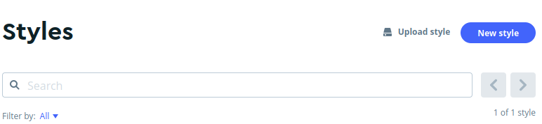
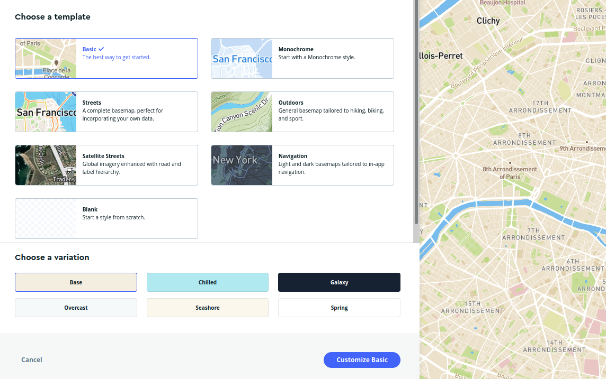
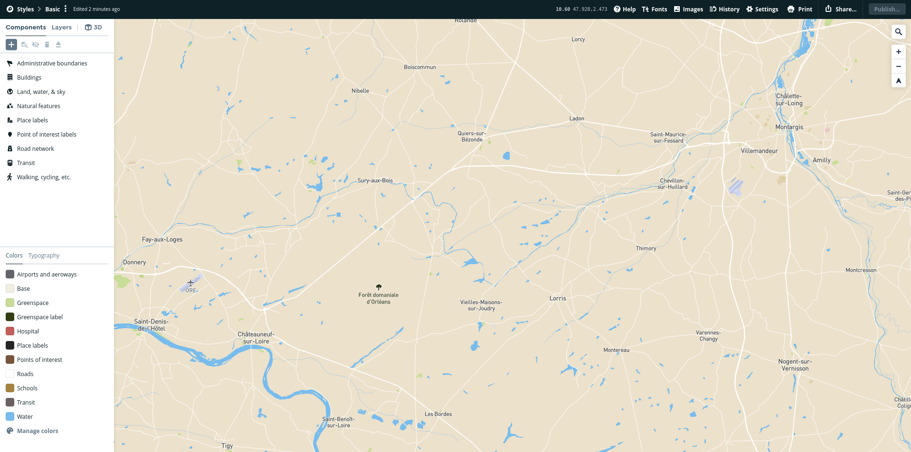

# 🎲 Organizando os geodados no Mapbox

Antes de iniciar o trabalho com o Mapbox, vale a pena relembrar algumas boas práticas ao trabalhar com dados geográficos, que irão ajudar no desenvolvimento do seu projeto.

* Adote um padrão consistente para nomear os arquivos;
* Crie uma pasta diferente para cada fonte de dado;
* Se possível, padronize o formato e a projeção dos geodados.

Atualmente, o Mapbox Studio aceita o formatos GeoTIFF para arquivos em malha (raster) e diversos outros para dados vetoriais (MBTiles, KML, GPX, GeoJSON, Shapefile zipado ou tabelas CSV). Neste segundo caso, recomendamos especialmente o uso do formato GeoJSON, ao invés do tradicional Shapefile, para usos na web. Você pode usar uma solução online e de código aberto como o [QGIS](https://qgis.org) ou [Mapshaper](https://mapshaper.org/) para fazer a conversão de formatos.

### Criando um novo mapa no Mapbox

Se você já organizou seus dados localmente e criou uma conta no [Mapbox](https://www.mapbox.com/), vá até o Mapbox Studio, que é como um “Photoshop para mapas”, segundo o site oficial da empresa.

Para começar, crie um estilo novo no botão azul "**New Style**".

Na tela seguinte, caso queira, selecione um modelo básico com imagem de satélite ou outro estilo de cartografias para o mapa base do projeto. Esta será a camada que, em geral, irá ficar abaixo das demais, para servir como referência. Após escolher o modelo/_template_ de sua preferência clique no botão azul '**Customize**'.

### Personalizando o mapa no Mapbox Studio

No menu da esquerda, temos duas abas **Styles** e **Components**. Vejamos como a documentação oficial do Mapbox descreve ambos:

> * Um componente é uma coleção de recursos relacionados do mapa, que você estiliza como uma única unidade. Os componentes podem incluir recursos de vários tipos (por exemplo, preenchimento, linha e símbolo). "Rede rodoviária", "limites administrativos" e "visualizações de dados com círculos" são exemplos de componentes. Cada componente contém uma ou mais camadas.
> * Uma camada é uma coleção de características (feições ou _features_) do mapa de um único tipo. 'Ponte-pedestre' é um exemplo de uma camada. No estilo Mapbox Streets, 'ponte-pedestre' é uma das mais de 50 camadas no componente de rede Rodoviária. As camadas podem fazer parte de um componente, mas não precisam estar ligadas a eles necessariamente. As camadas que não fazem parte de um componente são chamadas de camadas personalizadas.
>
> Fonte: [Style components - ](https://docs.mapbox.com/studio-manual/guides/components/)[Mabox Docs](https://docs.mapbox.com/studio-manual/guides/components/)

Na customização deste novo estilo, iremos enviar os geodados por meio do ícone de adição do lado esquerdo da tela, na opção ‘COMPONENTS’, selecionando a opção ‘DATA VISUALIZATION’ e em seguida ‘UPLOAD DATA’

### Compartilhando o mapa

Para conectar o Statamic na sua conta do Mapbox, você irá precisar destas duas informações:

**Mapbox** **Style**: um caminho do estilo criado no sistema do Mapbox. Por exemplo: `mapbox://styles/usuaria/ckcb6q2pe2b3149s11kk9zr9u`

**Mapbox Access Token**: é uma longa sequência aleatória de caracteres, que serve como senha para acessar seus dados no Mapbox. Por exemplo: `pk.eyJ1IjoibWFybUEjwiwiYS31IjlmYlhtaEkif2.vMxORYorRKnueDl3c5idQQ`

Você encontra ambos ao clicar no botão "**Share**", localizado no lado superior direito do Mapbox, na seção "**Developer resources**".
