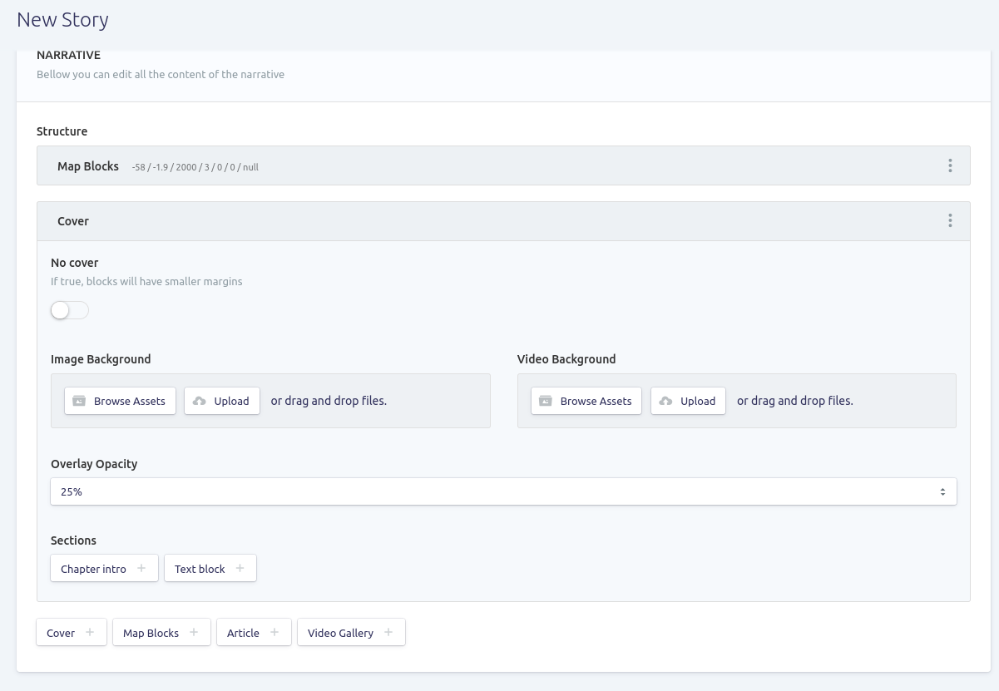
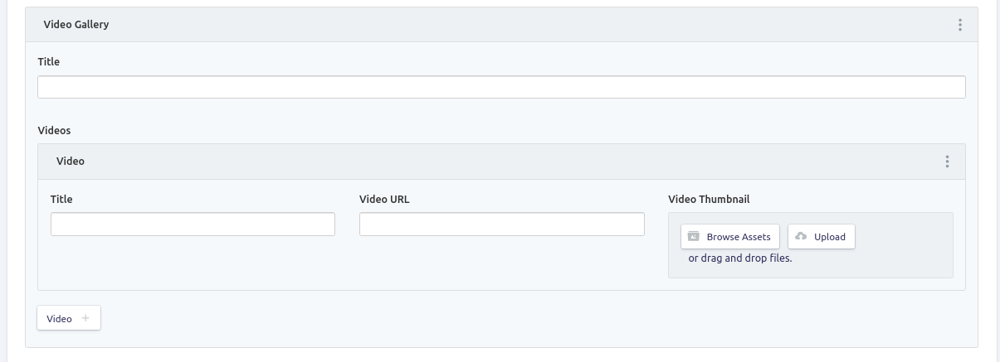
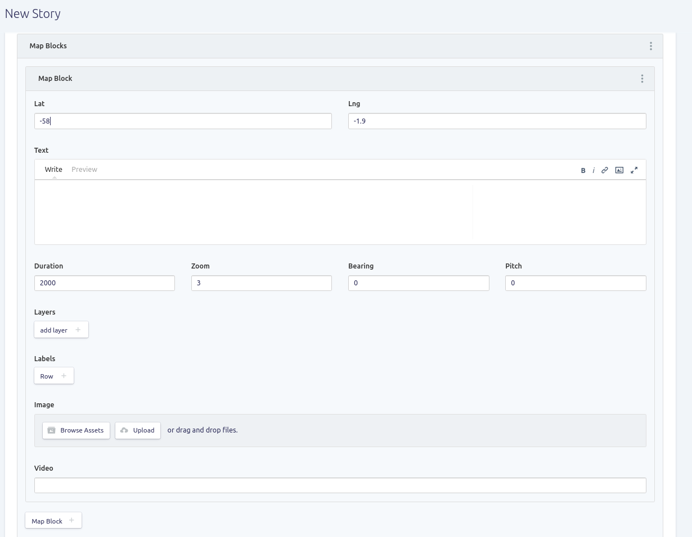

# 📝 Publicando uma história

Para publicar uma história, selecione a opção `Stories` e, em seguida, o botão `Create entry` na sua instalação. Repare que serão exibidas duas abas: `Content` and `Mapbox`. Na primeira, iremos inserir o conteúdo da página propriamente dito e, na segunda, fazemos a integração com o Mapbox. Iremos começar por esta última.

### Integração com o Mapbox

Clique na segunda aba, `Mapbox`.

Aqui, precisaremos dos códigos geradas na [etapa anterior](organizando-os-geodados-no-mapbox.md). Cole os códigos obtidos para os campos `Mapbox Style` e `Mapbox Access Token`.

Depois disso, será necessário definir qual será a visualização inicial ou "ponto de partida" no mapa. Você pode definir também uma localização (latitude e longitude, `Mapbox start lat` e `Mapbox Access Token`, respectivamente) e um nível de zoom para sua visualização.

### Content

A aba está dividia em duas partes. Na seção superior, é possível definir um título (title), resumo (abstract) e uma imagem de capa (cover image) para a história. Em seguida, há a seção `NARRATIVE`. A versão atual do Documental disponibiliza quatros tipos de elementos para a construção da narrativa.


Opções de elementos para construção da narrativa.


Para a construção de narrativas baseadas em mapas, a mais importante delas é o `Map blocks`. Porém, abaixo, iremos ver em detalhes todas opções.

### Cover

#### Article

#### Video gallery

### Map Blocks

* Duration:
* Zoom:
* Bearing:
* Pitch:

