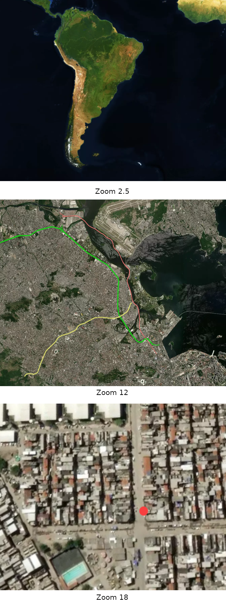

# 📝 Publicando uma história

Para publicar uma história, selecione a opção `Stories` e, em seguida, o botão `Create entry` na sua instalação. Repare que serão exibidas duas abas: `Content` and `Mapbox`. Na primeira, iremos inserir o conteúdo da página propriamente dito e, na segunda, fazemos a integração com o Mapbox. Iremos começar por esta última.

### Integração com o Mapbox

Clique na segunda aba, `Mapbox`.

Aqui, precisaremos dos códigos geradas na [etapa anterior](organizando-os-geodados-no-mapbox.md). Cole os códigos obtidos para os campos `Mapbox Style` e `Mapbox Access Token`.

Depois disso, será necessário definir qual será a visualização inicial ou "ponto de partida" no mapa. Você pode definir também uma localização (latitude e longitude, `Mapbox start lat` e `Mapbox Access Token`, respectivamente) e um nível de zoom para sua visualização.

Confira abaixo um exemplo real de como é a visualização de três valores diferente para o zoom, com imagens do projeto [Territórios de Exceção](./).

### Content

A aba está dividia em duas partes. Na seção superior, é possível definir um título (title), resumo (abstract) e uma imagem de capa (cover image) para a história. Em seguida, há a seção `NARRATIVE`. A versão atual do Documental disponibiliza quatros tipos de elementos para a construção da narrativa.


Opções de elementos para construção da narrativa.


Para a construção de narrativas baseadas em mapas, a mais importante delas é o `Map blocks`. Porém, abaixo, iremos ver em detalhes todas opções.

### Cover

Este elemento permite a inclusão de imagens, vídeos ou títulos ocupando toda largura da tela. Como o nome indica, é útil para fazer "capas", que servem para apresentar as seções ou capítulos (_chapters_) do seu trabalho.

É possível incluir, por exemplo, uma foto ou vídeo de impacto como imagem de fundo (_background_) e inserir campos de texto. Em `Chapter intro`, existem campos para definição de título e subtítulo. Textos mais longos podem ser incluídos como `Texto block`. Ambos irão aparecer sobrepostos na imagem de fundo, se definida.&#x20;

Para melhorar a legibilidade do texto, é possível também definir uma nível de transparência para a imagem, no campo `Overlay Opacity`.

#### Article

O elemento `Article` permite a inclusão de textos corridos, que aparecem centralizados na tela sobre um fundo branco. O Statamic oferece alguns recursos de formatação para hierarquização de títulos, negrito, itálico, listagens e enumerações, citações, links e códigos.

#### Video gallery

Este recurso permite a incorporação (_embed)_ de fontes externas de vídeos, como o YouTube e o Vimeo. É possível definir um título geral para a galeria e um ou mais vídeos para serem exibidos, cada um pode ter também seu próprio título.

Na visualização, os vídeos aparecem centralizados, ocupando toda largura da tela, e podem ser reproduzidos na própria página.

### Map Blocks

* Duration:
* Zoom:
* Bearing:
* Pitch:

