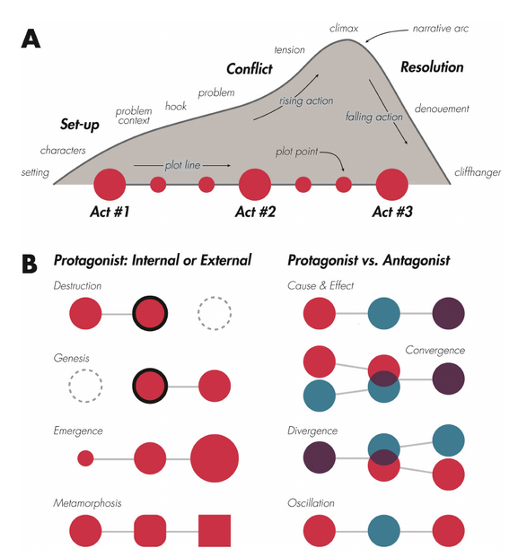

# 🖱️O que é scrollytelling?

Baseado nos termos "scroll" (rolagem) e "storytelling" (contação de histórias), scrollytelling designa recursos utilizados em páginas web, onde a rolagem de tela controla a narrativa. Esta prática ganhou destaque inicial em publicações online do chamado "long form journalism" ou "jornalismo forma longa", porém, os mesmos esquemas narrativos e tecnologias também podem ser utilizados de forma mais ampla para outros tipos de produção, não apenas jornalísticas. 

A rolagem de tela é uma da formas mais intuitivas de experiência do usuário durante a utilização de dispositivos eletrônicos, sejam eles tablets, computadores desktop ou celulares. Mesmo pessoas leigas ou crianças pequenas são capazes de reproduzir este gesto em celulares, por exemplo. Com o scrollytelling, este ato simples pode controlar a aparição de textos, fotos, vídeos ou a navegação por um mapa, como implementa o Documental, além de outras possibilidades, como diferentes formas de visualizar dados sobre um mesmo tema.

Nesta seção, apresentaremos softwares e plataformas para implementação de scrollytelling, esquemas narrativos úteis para utilizá-la com mapas e padrões comuns de visualização de informação cartográfica com scrollytelling. Ao fim, há uma lista de referências e leituras complementares.

# Softwares e plataformas

Existem diversos opções gratuitas ou de código aberto disponíveis atualmente para implementar páginas com recursos de *scrolytelling*. Enquanto a maioria demanda algum conhecimento em linguagens de programação, outras poucas opções fornecem uma interface gráfica para a implementação.

No caso do *scrollytelling*, em [artigo de janeiro de 2017](https://pudding.cool/process/how-to-implement-scrollytelling/), Russell Goldenberg elenca seis alternativas para construir uma página com scrollyteling "do zero", junto com demonstrações de seus códigos em funcionamento. A elas, foram adicionadas outras referências (entre elas a própria biblioteca mantida pelo autor, criada em outubro de 2017) e comentários próprios. As opções estão listadas de acordo com a contribuição mais recente feita em seus respectivos repositórios, do mais recentemente atualizado àquele que está mais tempo inativo, de acordo com consulta feita em 8 de junho de 2022.

- [Scrollama](https://github.com/russellgoldenberg/scrollama): biblioteca criada por Russel Goldenberg. Conta com uma [página com diferentes modelos prontos para uso](https://russellgoldenberg.github.io/scrollama/basic/). É uma opção relativamente acessível, mesmo para quem tem apenas conhecimentos básicos de JavaScript. O [vídeo tutorial de Jonathan Soma](https://www.youtube.com/watch?v=d7wTA9F-l8c) apresenta um bom passo a passo da implementação de uma página do tipo. Para trabalhar com mapas, vale conferir o repositório feito pelo Mapbox, com base no Scrollama. Última atualização do repositório: abril de 2022.

- [Scrollmagic](http://scrollmagic.io/): recomendada por Goldenberg para casos que exigem bastante personalização da interação. Última atualização do [repositório](https://github.com/janpaepke/ScrollMagic): dezembro de 2021.

- [Scrollstory](http://sjwilliams.github.io/scrollstory/): plugin em jQuery utilizado em algumas histórias do The New York Times. É recomendado por Goldenberg para iniciantes que utilizam jQuery. Última atualização do [repositório](https://github.com/sjwilliams/scrollstory): abril de 2021.

- [graph-scroll](https://1wheel.github.io/graph-scroll/): é plugin baseado na biblioteca D3 que fornece recursos simples para scrollytelling. Recomendável especialmente para visualizações de dados que também façam uso de D3. Última atualização do [repositório](https://github.com/1wheel/graph-scroll): março de 2020.

O artigo de Goldenberg também cita duas bibliotecas que estão há mais tempo inativas, como o [Waypoints](http://imakewebthings.com/waypoints/), recomendado como uma alternativa sólida para histórias altamente customizáveis. Porém, a última atualização do [repositório](https://github.com/imakewebthings/waypoints)é de setembro de 2016, mesmo ano do [in-view.js](https://github.com/camwiegert/in-view), que está oficialmente inativo e tem seu repositório oficial arquivado em modo somente leitura.

Além das alternativas acima, há a opção de se utilizar o [Svelte](https://svelte.dev/). Neste caso, vale a pena conferir o [modelo (template) do The Pudding](https://github.com/the-pudding/svelte-starter), que conta com um componente específico para este tipo de visualização interativa, e o [tutorial escrito por Connor Rothschild](https://www.connorrothschild.com/post/svelte-scrollytelling) mostrando como implementar scrollytelling com o Svelte.

## Plataformas 
Até o momento, não existem muitas opções gratuitas de plataformas que forneçam uma interface gráfica para a construção de narrativas com scrollyteling. A alternativa mais conhecida é o [Flourish.Studio](https://help.flourish.studio/article/21-controlling-stories-with-scrollytelling), que já publicou um artigo específico sobre este recurso. O Documental destaca-se por uma solução de código aberto que, a partir do Statamic e do Mapbox, fornece uma interface gráfica para controle do scrollyteling e inclusão dos conteúdos que formam a narrativa.

### Métodos de scrollytelling

Em seu artigo '[Responsive scrollytelling best practices](https://pudding.cool/process/responsive-scrollytelling/)', publicando no The Pudding, Russell Goldenberg destaca duas abordagens principais para uma narrativa do tipo. Uma delas é simplesmente empilhar textos, imagens, cartografias ou gráficos diversos. A outra consiste na rolagem de elementos sobre um fundo, em geral uma visualização de dados ou um mapa. No artigo, Goldenberg cita ainda outras abordagens possíveis, como usar o clique ou a função de deslizar, mas não as recomenda.

O Documental é uma solução que permite trabalhar com estas duas abordagens. É possível inclusive mesclar ambas, alternando entre textos ou imagens fixas.

### Textos e narrativas

Em artigo sobre design cartográfico como uma forma de "storytelling" visual, Robert E. Roth recomenda que sejam selecionados elementos para garantir uma linearidade durante uma narrativa. Ele menciona a estrutura em três atos como a abordagem mais tradicional e também cita a tipologia proposta por Phillips (2012) com oitos arcos narrativos comumente utilizados nas geociências e geografia.

A narrativa clássica, em três atos, é baseada em 3 etapas: set-up ou introdução, conflito e resolução. Ao longo deste processo, são apresentados personagens (que podem ser pessoas, mas também regiões geográficas, por exemplo), informações contextuais sobre um problema e outras informações. 

No início da narrativa, em geral, apresentam-se os personagens, ambientes e o contexto do problema em questão. Para scrollytelling baseados em mapas, é especialmente importante determinar uma ou mais localidades (onde?) e temporalidades (quando?). Também recomenda-se a inserção de uma "isca" (teaser ou click-bait) para capturar a atenção da pessoa leitora e gerar interesse na narrativa.

No segundo ato, o conflito, Roth enfatiza a criação incremental de uma tensão e o desenvolvimento dos personagens, a fim de gerar um maior interesse da audiência. Ele sugere a criação de "pontos narrativos", que podem ser pontos distintos em um mesmo mapa ou uma sequência de mapas e gráficos, para construir pausas e ritmos dentro de uma narrativa linear. 

O pesquisador destaca os oito arcos narrativos identificadas por Philips (2012) para narrativas baseadas em mapas. Eles dividem-se em dois grupos. Quatro destes arcos são baseados em um único protagonista (um local ou região, onde o conflito surge de forças internas ou externas). Estes quatro arcos narrativos são: a destruição, a gênese, a emergência ou a metamorfose. Os outros quatros baseiam-se no conflito entre duas ou mais forças ou personagens, que pode resultar em uma nova situação. Estes outros quatro arcos são: causa e efeito, convergência, divergência e oscilação.

Por fim, na resolução, o ato final da estrutura narrativa em três etapas, chega-se ao climax. Esta conclusão pode se dar tanto com a convergência dos personagens, problemas e ambientações criadas por uma determinada solução, quanto deixando a carga da audiência preencher as lacunas de sentido com suas próprias experiências. 

Como Roth, destaca muitos profissionais consideram este esquema super-simplificado e adotam estruturas não-lineares ou paralelas para contar histórias. De todo modo, ainda assim, estes elementos e estruturas básicas podem estimular novas práticas e abordagens para contar histórias com mapas.

### Definição do mapa base

### Movimentos de câmera sobre mapas

#### Zoom in/out

O movimento de aproximar ou afastar a visão sobre o mapa ajuda as narrativas a alternarem entre uma dimensão "macro" (uma visão do globo terrestre para situar geograficamente o leitor ou um mapa cloroplético, por exemplo) e "micro" (pontos no mapa relacionados a fotos ou uma subdivisão fronteiriça como os municípios dentro de um estado).

#### Pan

#### Sobreposição de imagens

## Referências

Robert E. Roth (2020): Cartographic Design as Visual Storytelling: Synthesis and Review of Map-Based Narratives, Genres, and Tropes, The Cartographic Journal, DOI: 10.1080/00087041.2019.1633103

Phillips J. (2012): Storytelling in Earth Sciences: The Eight Basic Plots - Earth-Science Reviews 115 (3) pp.153–162 DOI:10. 1016/j.earscirev.2012.09.005.

